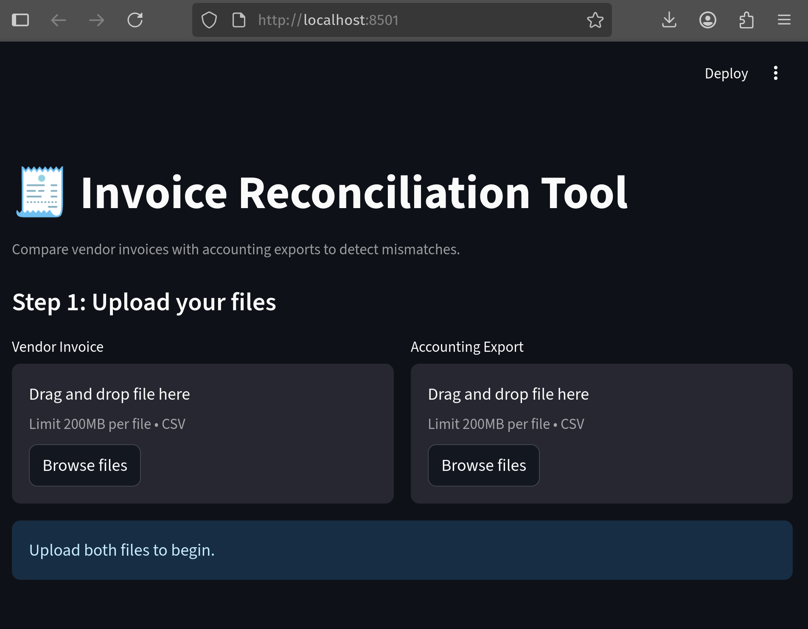

# 🧾 Invoice Reconciliation Tool

**Streamlit app to compare vendor invoices with accounting exports and flag mismatches.**  
Ideal for finance teams, junior analysts, or entry-level devs supporting business ops.

---

## 🚀 Features

✅ Upload 2 CSVs: vendor invoices + accounting system export  
✅ Auto-match on `InvoiceNumber`  
✅ Highlight mismatched or missing records  
✅ Generate discrepancy report (with download)

---

## 🖥 Demo Screenshot



---

## 🧠 Tech Stack

- Python 3
- Streamlit
- Pandas

---

## 📂 Sample Input

```csv
InvoiceNumber,Date,Amount
INV-001,2023-09-01,1200
INV-002,2023-09-02,950
INV-003,2023-09-03,700
````

---

## 🔧 Run Locally

```bash
git clone https://github.com/Giuseppe552/invoice-reconciliation-tool.git
cd invoice-reconciliation-tool
python3 -m venv venv
source venv/bin/activate
pip install -r requirements.txt
streamlit run streamlit_app.py
```

---

## 👨‍💼 Why This Exists

This tool mimics a simple but real-world task often handled in finance teams:
**checking data accuracy between two systems.**

Built to show hands-on understanding of:

* Data matching & discrepancy handling
* Automating admin tasks with code
* Front-end UX for business users

---

🛠 Built by Giuseppe 

```

